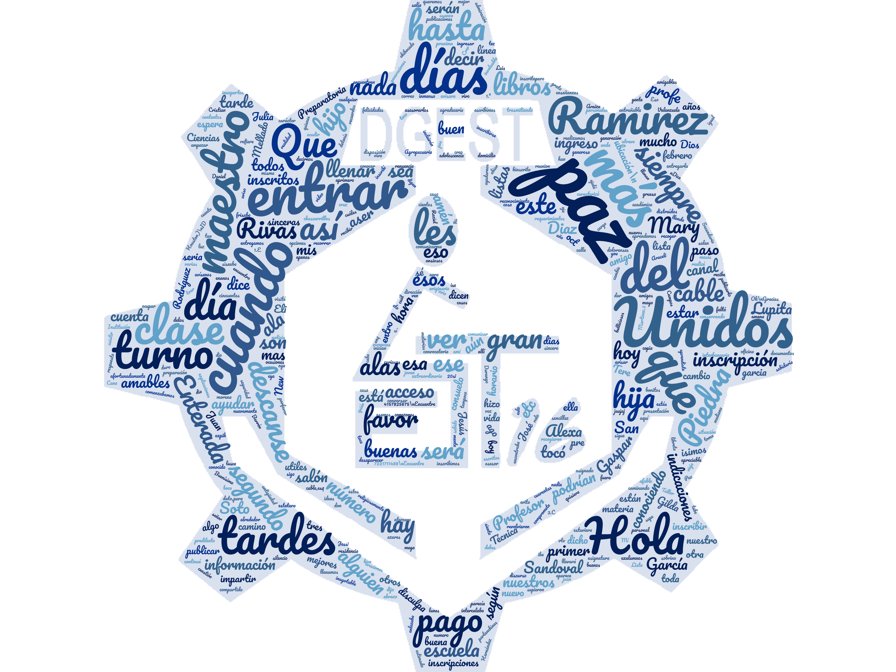

# IVYHacks

## Inspiration
We are inspired by the students and workers who are going through a difficult situation at the moment due to COVID-19. It is difficult to know what is the reason why people do not connect to their meetings or why they are not complying with the established deliverables, thinking about this problem we develop virt-people. We want to be able to determine what that reason is and how it is that people are getting involved with virtual activities.

## Challenges we ran into
Learn to use n8n and facebook-graph api and how connect all data to send it to ibm cloud for build a emotional cloud and analyze in ibm cloud, then build a dashboard with all that data to visualize.

## What we learned
We learned that when it comes to education, socio-emotional education contributes to the formation of students in order to become responsible, free, inclusive and caring people who promote the well-being of their community. We learned that it is a fundamental piece in human development and learning where factors such as self-knowledge, self-regulation, empathy and collaboration are everything to create a safe, reliable learning environment where they feel peace and tranquility.

## What it does

We take as an example the information of a secondary school in Mexico that uses the social network Facebook to offer its classes online, the main reason being that Facebook is free through free basics and did not need the installation of any other application given the problems of connectivity that they have in their locality, so we take the information from the facebook groups (36 groups) and from their facebook page, we connect them to n8n to consume all the information through facebook-grap api, automating the process and creating a csv, later we passed all the information to a notebook in which the data would be loaded afterwards it would be prepared and processed by the IBM NLU, which gave us an enriched csv that would later be saved in cloud object storage to later be able to start the analysis of sentiment and emotions of the dataframes, finally making use of pixiedust and wordcloud we were able to make the corresponding graphs Regarding the relationship between the learning style and the emotions and feelings generated by the publications of the tasks and works of their teachers, the analysis of learning styles was carried out on a total of 1200 students, all the information that you see in the graphs it is real.In this case we can resumen as a dashboard where we can show teachers all this information by grade, group, updated and real time at the touch of a button, helping to minimize the digital illiteracy that exists in teachers through the personalization of education eliminating friction when use different technologies.

## How we built it

* IBM Cloud Pak for Data Project: IvyHacks
* Cloud Object Storage: Cloud Object Storage-rp
* Natural Language Understanding: NLU-Hacks
* Visual Recognition: VisualR-Hacks
* Cognos Dashboard Embedded: IBM-Cognos-Dash-Hacks
* IBM Noteboooks IVYHacks
* n8n
* Node.js
* Pixiedust
* Pandas
* Wordcloud
* Python
* GitHub Projects
* GitHub

We take the information from the facebook groups (36 groups) and from their facebook page, we connect them to n8n to consume all the information through facebook-grap api, automating the process and creating a csv, later we passed all the information to a notebook in which the data would be loaded afterwards it would be prepared and processed by the IBM NLU, which gave us an enriched csv that would later be saved in cloud object storage to later be able to start the analysis of sentiment and emotions of the dataframes, finally making use of pixiedust and wordcloud we were able to make the corresponding graphs Regarding the relationship between the learning style and the emotions and feelings generated by the publications of the tasks and works of their teachers, the analysis of learning styles was carried out on a total of 1200 students, all the information that you see in the graphs it is real.In this case we can resumen as a dashboard where we can show teachers all this information by grade, group, updated and real time at the touch of a button, helping to minimize the digital illiteracy that exists in teachers through the personalization of education eliminating friction when use different technologies.

## What's next for getEmotional

a dashboard where we can show teachers all this information by grade, group, updated and real time at the touch of a button, helping to minimize the digital illiteracy that exists in teachers through the personalization of education eliminating friction when use different technologies.
